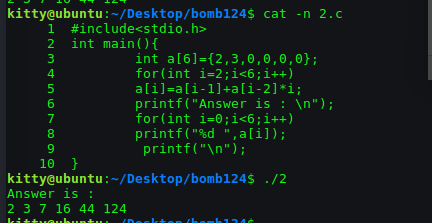
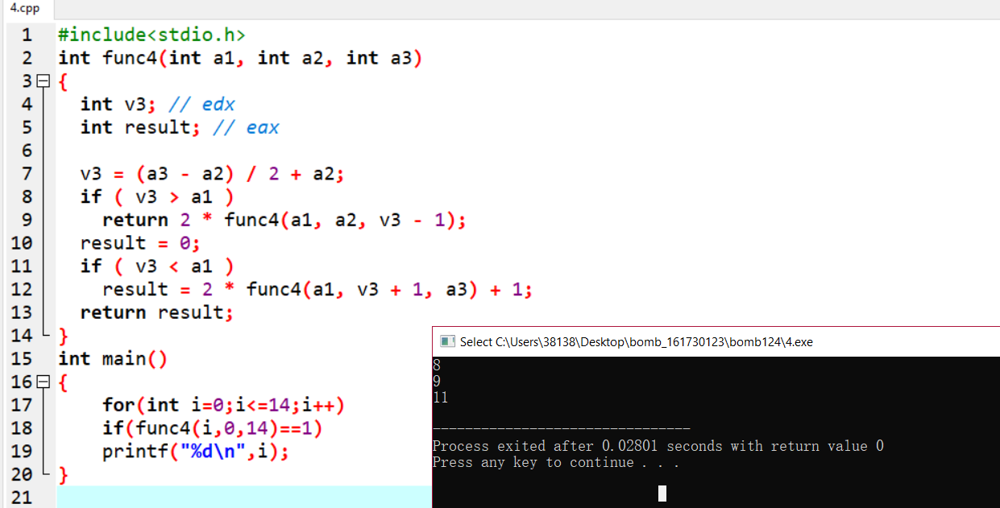
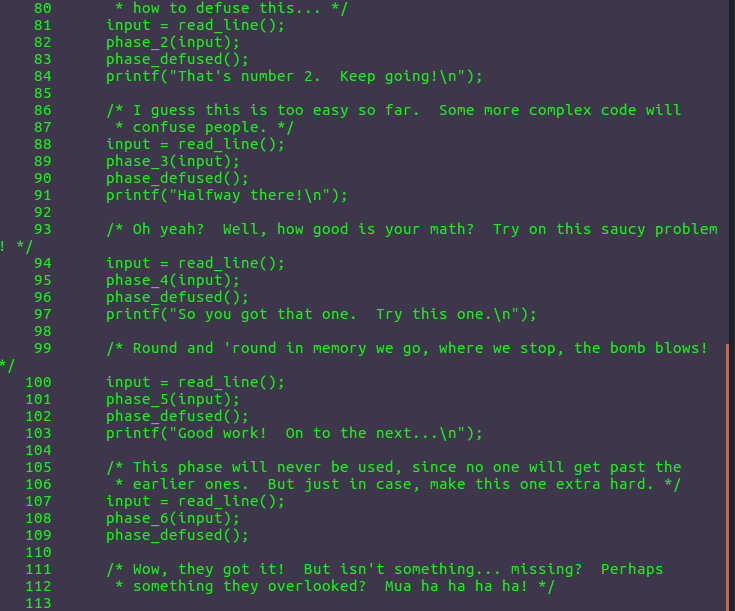
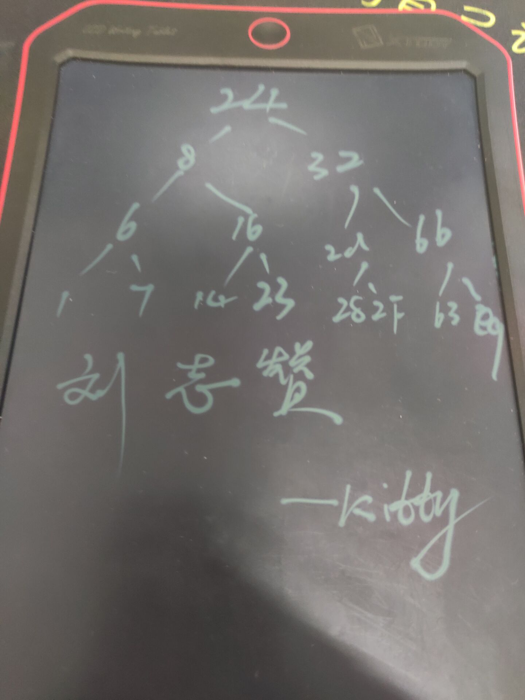

# 南京航空航天大学《计算机组成原理Ⅱ课程设计》报告

* 姓名：刘志赞
* 班级：1617304
* 学号：161730123
* 报告阶段：bomblab
* 完成日期：2019.5.1
* 本次实验，我完成了所有内容。

## 目录

[TOC]

## 准备
```
objdump -d > bombasm
```
然后文本打开，开始肝就完事了
最后隐藏题也结束了

整体payload
```
The future will be better tomorrow.
2 3 7 16 44 124
0 109
8 1 SecretNuaa
LLLLLL
5 4 1 3 2 6
99
```
## phase_1
核心代码
```
 8048b36:	68 24 a0 04 08       	push   $0x804a024
 8048b3b:	ff 75 08             	pushl  0x8(%ebp)
 8048b3e:	e8 6b 04 00 00       	call   8048fae <strings_not_equal>
 8048b43:	83 c4 10             	add    $0x10,%esp
 8048b46:	85 c0                	test   %eax,%eax
 8048b48:	74 05                	je     8048b4f <phase_1+0x1f>
 8048b4a:	e8 62 05 00 00       	call   80490b1 <explode_bomb>
```
第一行把$0x402400赋值给压入栈,我们可以通过gdb查看这个地址储存了什么东西


找到字符串`The future will be better tomorrow.`
然后调用strings_not_equal是否相等函数，
然后比较了%eax,%eax如果相等那么跳过了爆炸函数而正常运行下去，所以第一题只需要输入
```
The future will be better tomorrow.
```
## phase_2
要求读取6个数，并且首地址放在%esp上
```
 8048b6b:	e8 69 05 00 00       	call   80490d9 <read_six_numbers>
```
然后判断（%rsp）是否为2,第二个数是不是3,否则直接跳转到爆炸，我们知道了2，3
```
 8048b73:	83 7d dc 02          	cmpl   $0x2,-0x24(%ebp)
 8048b77:	75 06                	jne    8048b7f <phase_2+0x2e>
 8048b79:	83 7d e0 03          	cmpl   $0x3,-0x20(%ebp)
 8048b7d:	74 05                	je     8048b84 <phase_2+0x33>
 8048b7f:	e8 2d 05 00 00       	call   80490b1 <explode_bomb>
```
然后跳转到此地
```
 8048b84:	8d 5d dc             	lea    -0x24(%ebp),%ebx
 8048b87:	be 02 00 00 00       	mov    $0x2,%esi
 8048b8c:	89 f0                	mov    %esi,%eax
 8048b8e:	0f af 03             	imul   (%ebx),%eax
 8048b91:	03 43 04             	add    0x4(%ebx),%eax
 8048b94:	39 43 08             	cmp    %eax,0x8(%ebx)
 8048b97:	74 05                	je     8048b9e <phase_2+0x4d>
```
然后对比后面一个数，每次往后移动一位，但是和前面的进行了比较
```
 8048b9e:	83 c6 01             	add    $0x1,%esi
 8048ba1:	83 c3 04             	add    $0x4,%ebx
 8048ba4:	83 fe 06             	cmp    $0x6,%esi
 8048ba7:	75 e3                	jne    8048b8c <phase_2+0x3b>
 8048ba9:	8b 45 f4             	mov    -0xc(%ebp),%eax
 8048bac:	65 33 05 14 00 00 00 	xor    %gs:0x14,%eax
```
比较规则是每次往后移动的时候，这个数等于前面一个数加上再前面一个数乘以下标，大概是
`a[n]=a[n-1]+a[n-2]*n`而第一个数是2，第二个数是3
然后可以自己跑个脚本


```
2 3 7 16 44 124 
```
## phase_3
首先有一个输入，使用gdb查看一下输入的格式
```
  pwndbg> p (char*)0x804a1ef
  $3 = 0x804a1ef "%d %d"
```
然后比较返回值
```
 8048bea:	83 f8 01             	cmp    $0x1,%eax
 8048bed:	7f 05                	jg     8048bf4 <phase_3+0x33>
 8048bef:	e8 bd 04 00 00       	call   80490b1 <explode_bomb>
```
如果大于1往后走，否则爆了，而这个返回值是scanf的返回值，意思是我们输入的整数的个数，所以这题输入2个值。
```
 8048bf4:	83 7d ec 07          	cmpl   $0x7,-0x14(%ebp)
 8048bf8:	77 3b                	ja     8048c35 <phase_3+0x74>
 8048bfa:	8b 45 ec             	mov    -0x14(%ebp),%eax
 8048bfd:	ff 24 85 80 a0 04 08 	jmp    *0x804a080(,%eax,4)
```
然后比较了第一个值如果大于7那么直接爆炸了，然后把第一个值赋值给了eax,然后跳转到jmpq   *0x804a080(,%eax,4)，即0x804a080地址往后移动%rax个字节，一个字节为4位，所以我们先看看跳转表怎么样
```
pwndbg> x/10ww 0x804a080
0x804a080:	0x08048c41	0x08048c04	0x08048c0b	0x08048c12
0x804a090:	0x08048c19	0x08048c20	0x08048c27	0x08048c2e

```
当%rax为0的时候跳转到0x08048c41
```
 8048c41:	b8 6d 00 00 00       	mov    $0x6d,%eax
 8048c46:	3b 45 f0             	cmp    -0x10(%ebp),%eax
 8048c49:	74 05                	je     8048c50 <phase_3+0x8f>
 8048c4b:	e8 61 04 00 00       	call   80490b1 <explode_bomb>
```
把$0x6d传入%eax,和第二个数比较，如果相等就结束，否则爆炸

很明显能看到是一个switch结构，0x6d等于109
所以答案不为一，可以为
```
  0 109
```
其他答案我就不一一举了
## phase_4
首先有一个输入，使用gdb查看一下输入的格式
```
pwndbg> p (char *)0x804a1ef
$4 = 0x804a1ef "%d %d"

```
然后通过这一行判断我们读入数字的个数,即2个，并且第一个数在rsp上第二个在rcx上
```
 8048ce8:	83 f8 02             	cmp    $0x2,%eax
 8048ceb:	75 06                	jne    8048cf3 <phase_4+0x34>
```
然后对第一个数比较了，jbe为无符号小于等于则跳转，即我们的第一个数小于等于14
```
 8048ced:	83 7d ec 0e          	cmpl   $0xe,-0x14(%ebp)
 8048cf1:	76 05                	jbe    8048cf8 <phase_4+0x39>
 8048cf3:	e8 b9 03 00 00       	call   80490b1 <explode_bomb>
```
然后把0xe赋值给%edx,0x0赋值给%esi,我们输入的第一个值给%edi，然后调用了func4
相当于给func4传入3个参数（%edi{我们输入的},%esi{0x0},%edx{0xe},并且答案等于0
现在分析func4
假设func4(int x,int y,int z)
那么首先的
```
	89 d0                	mov    %edx,%eax
	29 f0                	sub    %esi,%eax
```
%eax为z-y,然后一段操作
```
	89 c1                	mov    %eax,%ecx
c1 e9 1f             	shr    $0x1f,%ecx
	01 c8                	add    %ecx,%eax
```
很奇怪先让%ecx等于0,然后再加上%eax，其实还是%eax还是值z-y啊，估计是为了防止负数吧
然后
```
d1 f8                	sar    %eax
```
算术右移，其实就是处以2,然后  
```
8d 0c 30             	lea    (%rax,%rsi,1),%ecx
```
让%ecx=%rax+%rsi即等于（y-z）/2 + y
```
 	39 f9                	cmp    %edi,%ecx
	7e 0c                	jle    400ff2 <func4+0x24>
	8d 51 ff             	lea    -0x1(%rcx),%edx
	e8 e0 ff ff ff       	callq  400fce <func4>
```
如果x大于%ecx就跳到400ff2
  否则 调用
  ```
	e8 e0 ff ff ff       	callq  400fce <func4>
	01 c0                	add    %eax,%eax
  ```
  并且加倍
400ff2 让%eax=0
```
 8048c9f:	39 ca                	cmp    %ecx,%edx
 8048ca1:	7d 15                	jge    8048cb8 <func4+0x55>
 8048ca3:	83 ec 04             	sub    $0x4,%esp
 8048ca6:	56                   	push   %esi
 8048ca7:	83 c2 01             	add    $0x1,%edx
 8048caa:	52                   	push   %edx
 8048cab:	51                   	push   %ecx
 8048cac:	e8 b2 ff ff ff       	call   8048c63 <func4>
 8048cb1:	83 c4 10             	add    $0x10,%esp
 8048cb4:	8d 44 00 01          	lea    0x1(%eax,%eax,1),%eax
 8048cb8:	8d 65 f8             	lea    -0x8(%ebp),%esp
 8048cbb:	5b                   	pop    %ebx
 8048cbc:	5e                   	pop    %esi
 8048cbd:	5d                   	pop    %ebp
 8048cbe:	c3                   	ret      
```
整体函数大致为
```
int func4(int a1, int a2, int a3)
{
  int v3; // edx
  int result; // eax

  v3 = (a3 - a2) / 2 + a2;
  if ( v3 > a1 )
    return 2 * func4(a1, a2, v3 - 1);
  result = 0;
  if ( v3 < a1 )
    result = 2 * func4(a1, v3 + 1, a3) + 1;
  return result;
}
```
最后判断了第二个数是不是0,如果不是就爆
```
 8048d0f:	83 7d f0 01          	cmpl   $0x1,-0x10(%ebp)
 8048d13:	74 05                	je     8048d1a <phase_4+0x5b>
 8048d15:	e8 97 03 00 00       	call   80490b1 <explode_bomb>
```
最终脚本为
```c
#include<stdio.h>
int func4(int a1, int a2, int a3)
{
  int v3; // edx
  int result; // eax

  v3 = (a3 - a2) / 2 + a2;
  if ( v3 > a1 )
    return 2 * func4(a1, a2, v3 - 1);
  result = 0;
  if ( v3 < a1 )
    result = 2 * func4(a1, v3 + 1, a3) + 1;
  return result;
}
int main()
{
	for(int i=0;i<=14;i++)
	if(func4(i,0,14)==1)
	printf("%d\n",i);
}

```
所以答案可以为
```
8 1
9 1
11 1
```

## phase_5
观察发现前面的代码没啥用从这里开始
```
 8048d38:	e8 4f 02 00 00       	call   8048f8c <string_length>
 8048d3d:	83 c4 10             	add    $0x10,%esp
 8048d40:	83 f8 06             	cmp    $0x6,%eax
 8048d43:	74 05                	je     8048d4a <phase_5+0x1d>
 8048d45:	e8 67 03 00 00       	call   80490b1 <explode_bomb>
```
这里判断长度为6

```
 8048d54:	0f b6 10             	movzbl (%eax),%edx
 8048d57:	83 e2 0f             	and    $0xf,%edx
 8048d5a:	03 0c 95 a0 a0 04 08 	add    0x804a0a0(,%edx,4),%ecx
 8048d61:	83 c0 01             	add    $0x1,%eax
 8048d64:	39 d8                	cmp    %ebx,%eax
```
 v3 += a[*result++ & 0xF];
意思就是我们输入的6个字符串的ascii值的尾后4位组成的数 作为数组的下标要让数组之和等于我们的66所以先罗列出这里的数组0x804a0a0
`a[16]={2,10,6,1,12,10,9,3,4,7,14,5,11,8,15,13}`


最后判断是否和$0x42相等 就是6个相加等于66
```
 8048d68:	83 f9 42             	cmp    $0x42,%ecx
 8048d6b:	74 05                	je     8048d72 <phase_5+0x45>
 8048d6d:	e8 3f 03 00 00       	call   80490b1 <explode_bomb>
```
问题就简单了，我们找到11的下标来个6次就行11的下标是12就是C，查看ascii表4C是L
最后拿到答案
```
LLLLLL
```
## phase_6
第六关代码是真的长啊
先读取6个数
```
 8048d7f:	65 a1 14 00 00 00    	mov    %gs:0x14,%eax
 8048d85:	89 45 f4             	mov    %eax,-0xc(%ebp)
 8048d88:	31 c0                	xor    %eax,%eax
 8048d8a:	8d 45 c4             	lea    -0x3c(%ebp),%eax //为函数<read_six_numbers>传参
 8048d8d:	50                   	push   %eax //输入的六个数的第一个数储存在地址-0x30(%ebp)中 其余的值顺序储存在从-0x30(%ebp)的递增的地址中
 8048d8e:	ff 75 08             	pushl  0x8(%ebp)
 8048d91:	e8 43 03 00 00       	call   80490d9 <read_six_numbers>
```
拿到六个数 然后进行了一大堆的限制判断
```
 8048d99:	be 00 00 00 00       	mov    $0x0,%esi
 8048d9e:	8b 44 b5 c4          	mov    -0x3c(%ebp,%esi,4),%eax
 8048da2:	83 e8 01             	sub    $0x1,%eax
 8048da5:	83 f8 05             	cmp    $0x5,%eax
 8048da8:	76 05                	jbe    8048daf <phase_6+0x38>
```
如果%eax>5则爆炸，说明%eax的应该<=5,由于%eax等于输入的第%esi+1个数-1,所以输入的第%esi+1个数的值应该<=6
```
 8048db7:	89 f3                	mov    %esi,%ebx
 8048db9:	8b 44 9d c4          	mov    -0x3c(%ebp,%ebx,4),%eax
 8048dbd:	39 44 b5 c0          	cmp    %eax,-0x40(%ebp,%esi,4)
 8048dc1:	75 05                	jne    8048dc8 <phase_6+0x51>
 8048dc3:	e8 e9 02 00 00       	call   80490b1 <explode_bomb>
```
把储存第%esi+1个数的地址赋值给%ebx,第%ebx地址储存的数与第%esi个进行比较，第一次%ebx指向第%esi+1个数,相等则爆炸然后
```
 8048dbd:	39 44 b5 c0          	cmp    %eax,-0x40(%ebp,%esi,4)
 8048dc1:	75 05                	jne    8048dc8 <phase_6+0x51>
 8048dc3:	e8 e9 02 00 00       	call   80490b1 <explode_bomb>
```
地址-0x4c(%ebp)储存的值+1,如果地址-0x4c(%ebp)储存的值<=5
其实上面只是一堆的判断但是重复操作了一个链表，$0x804c13c是首地址，整体思想就是让我们输入6个数，这个六个数是1~6的随意的顺序，但是这个顺序当作链表的下表能够让这个链表由小到大排序，我们先拿到这个链表的数据

第一个数数据，第二个是类似下标，第三个类似于*next，还好在内存里他们在一堆，如果不在一堆一个个拿出来也可以
```
0x2e2 0x3a5 0x2fa 0x1dc 0x193 0x3c4
```
然后由小到大排序后的下标顺序为
```
5 4 1 3 2 6
```
## 进入secret_phase
我们发现在phase_6下面有一个fun7，还有个secret_phase，肯定不止6关还有第七影藏关，那么我们想想怎么进去呢
我们查看bomb.c

每段phase函数运行完成以后又会运行一个phase_defused()函数，这个函数我们在上述拆炸弹过程中都没有用到,所以我们可以看看这个函数里做了啥
```
(gdb) disass phase_defused
Dump of assembler code for function phase_defused:
   0x08049216 <+0>:	push   %ebp
   0x08049217 <+1>:	mov    %esp,%ebp
   0x08049219 <+3>:	sub    $0x68,%esp
   0x0804921c <+6>:	mov    %gs:0x14,%eax
   0x08049222 <+12>:	mov    %eax,-0xc(%ebp)
   0x08049225 <+15>:	xor    %eax,%eax
   0x08049227 <+17>:	cmpl   $0x6,0x804c3cc
   0x0804922e <+24>:	jne    0x804929f <phase_defused+137>
   0x08049230 <+26>:	sub    $0xc,%esp
   0x08049233 <+29>:	lea    -0x5c(%ebp),%eax
   0x08049236 <+32>:	push   %eax
   0x08049237 <+33>:	lea    -0x60(%ebp),%eax
   0x0804923a <+36>:	push   %eax
   0x0804923b <+37>:	lea    -0x64(%ebp),%eax
   0x0804923e <+40>:	push   %eax
   0x0804923f <+41>:	push   $0x804a249
   0x08049244 <+46>:	push   $0x804c4d0
   0x08049249 <+51>:	call   0x8048810 <__isoc99_sscanf@plt>
   0x0804924e <+56>:	add    $0x20,%esp
   0x08049251 <+59>:	cmp    $0x3,%eax
   0x08049254 <+62>:	jne    0x804928f <phase_defused+121>
   0x08049256 <+64>:	sub    $0x8,%esp
   0x08049259 <+67>:	push   $0x804a252
   0x0804925e <+72>:	lea    -0x5c(%ebp),%eax
   0x08049261 <+75>:	push   %eax
   0x08049262 <+76>:	call   0x8048fae <strings_not_equal>
   0x08049267 <+81>:	add    $0x10,%esp
   0x0804926a <+84>:	test   %eax,%eax
   0x0804926c <+86>:	jne    0x804928f <phase_defused+121>
   0x0804926e <+88>:	sub    $0xc,%esp
   0x08049271 <+91>:	push   $0x804a118
   0x08049276 <+96>:	call   0x80487c0 <puts@plt>
   0x0804927b <+101>:	movl   $0x804a140,(%esp)
   0x08049282 <+108>:	call   0x80487c0 <puts@plt>
   0x08049287 <+113>:	call   0x8048eac <secret_phase>
   0x0804928c <+118>:	add    $0x10,%esp
   0x0804928f <+121>:	sub    $0xc,%esp
   0x08049292 <+124>:	push   $0x804a178
   0x08049297 <+129>:	call   0x80487c0 <puts@plt>
   0x0804929c <+134>:	add    $0x10,%esp
   0x0804929f <+137>:	mov    -0xc(%ebp),%eax
   0x080492a2 <+140>:	xor    %gs:0x14,%eax
   0x080492a9 <+147>:	je     0x80492b0 <phase_defused+154>
   0x080492ab <+149>:	call   0x8048790 <__stack_chk_fail@plt>
   0x080492b0 <+154>:	leave  
   0x080492b1 <+155>:	ret    
End of assembler dump.
```
这段代码首先是比较了0x804c3cc和6的大小，通过对0x804c3d0 gdb调试，发现没过一关这个数+1，意思是要过前面6关才能之后进入
然后查一下出现在代码里的神秘的内存区域的内容
```
(gdb) p(char*)0x804a249
$1 = 0x804a249 "%d %d %s"
```
现在我们想一想在哪里会调用这玩意，以前我们函数的输入是直接从当前输入的一行中读入数据，而我们输入的一行字符串的首地址就储存在0x8(%ebp)，所以以前是直接传的0x8(%ebp)，所以这里传的地址就极有可能是我们某次输入一行字符串的首地址。那么接下来我们只要去查看这个地址到底是哪次输入字符串的首地址就能知道在哪里调用了，经过gdb调试发现是第四关使用了这个地址，继续查看代码里的这个地址
```
(gdb) p(char*)0x804a252
$3 = 0x804a252 "SecretNuaa"
```
结论我们在进行phase_4的输入的还需要在两个数字后面输入一个字符串"SecretNuaa"
## secret_phase
secret_phase的代码还是挺少的
```
 8048eac:	55                   	push   %ebp
 8048ead:	89 e5                	mov    %esp,%ebp
 8048eaf:	53                   	push   %ebx
 8048eb0:	83 ec 04             	sub    $0x4,%esp
 8048eb3:	e8 5b 02 00 00       	call   8049113 <read_line>
 8048eb8:	83 ec 04             	sub    $0x4,%esp
 8048ebb:	6a 0a                	push   $0xa
 8048ebd:	6a 00                	push   $0x0
 8048ebf:	50                   	push   %eax
 8048ec0:	e8 bb f9 ff ff       	call   8048880 <strtol@plt>
 8048ec5:	89 c3                	mov    %eax,%ebx
 8048ec7:	8d 40 ff             	lea    -0x1(%eax),%eax
 8048eca:	83 c4 10             	add    $0x10,%esp
 8048ecd:	3d e8 03 00 00       	cmp    $0x3e8,%eax
 8048ed2:	76 05                	jbe    8048ed9 <secret_phase+0x2d>
 8048ed4:	e8 d8 01 00 00       	call   80490b1 <explode_bomb>
 8048ed9:	83 ec 08             	sub    $0x8,%esp
 8048edc:	53                   	push   %ebx
 8048edd:	68 88 c0 04 08       	push   $0x804c088
 8048ee2:	e8 73 ff ff ff       	call   8048e5a <fun7>
 8048ee7:	83 c4 10             	add    $0x10,%esp
 8048eea:	83 f8 03             	cmp    $0x3,%eax
 8048eed:	74 05                	je     8048ef4 <secret_phase+0x48>
 8048eef:	e8 bd 01 00 00       	call   80490b1 <explode_bomb>
 8048ef4:	83 ec 0c             	sub    $0xc,%esp
 8048ef7:	68 48 a0 04 08       	push   $0x804a048
 8048efc:	e8 bf f8 ff ff       	call   80487c0 <puts@plt>
 8048f01:	e8 10 03 00 00       	call   8049216 <phase_defused>
 8048f06:	83 c4 10             	add    $0x10,%esp
 8048f09:	8b 5d fc             	mov    -0x4(%ebp),%ebx
 8048f0c:	c9                   	leave  
 8048f0d:	c3                   	ret    
```
 先输入一个字符串，然后转化为数字(范围为`[1~0x3e9]`)，再把这个数作为函数<`fun7>`的参数。要求使`<fun7>`的返回值等于3。
 而这个转换的意思就是 比如你传入123最后得到的数字就是123，如果是字符串貌似是十六进制编码然后转int?为了不作死我觉得可以尽量使用十进制。类似于python的int();函数
然后分析我们的fun7函数
```
08048e5a <fun7>:
 8048e5a:	55                   	push   %ebp
 8048e5b:	89 e5                	mov    %esp,%ebp
 8048e5d:	53                   	push   %ebx
 8048e5e:	83 ec 04             	sub    $0x4,%esp
 8048e61:	8b 55 08             	mov    0x8(%ebp),%edx
 8048e64:	8b 4d 0c             	mov    0xc(%ebp),%ecx
 8048e67:	85 d2                	test   %edx,%edx
 8048e69:	74 37                	je     8048ea2 <fun7+0x48>
 8048e6b:	8b 1a                	mov    (%edx),%ebx
 8048e6d:	39 cb                	cmp    %ecx,%ebx
 8048e6f:	7e 13                	jle    8048e84 <fun7+0x2a>
 8048e71:	83 ec 08             	sub    $0x8,%esp
 8048e74:	51                   	push   %ecx
 8048e75:	ff 72 04             	pushl  0x4(%edx)
 8048e78:	e8 dd ff ff ff       	call   8048e5a <fun7>
 8048e7d:	83 c4 10             	add    $0x10,%esp
 8048e80:	01 c0                	add    %eax,%eax
 8048e82:	eb 23                	jmp    8048ea7 <fun7+0x4d>
 8048e84:	b8 00 00 00 00       	mov    $0x0,%eax
 8048e89:	39 cb                	cmp    %ecx,%ebx
 8048e8b:	74 1a                	je     8048ea7 <fun7+0x4d>
 8048e8d:	83 ec 08             	sub    $0x8,%esp
 8048e90:	51                   	push   %ecx
 8048e91:	ff 72 08             	pushl  0x8(%edx)
 8048e94:	e8 c1 ff ff ff       	call   8048e5a <fun7>
 8048e99:	83 c4 10             	add    $0x10,%esp
 8048e9c:	8d 44 00 01          	lea    0x1(%eax,%eax,1),%eax
 8048ea0:	eb 05                	jmp    8048ea7 <fun7+0x4d>
 8048ea2:	b8 ff ff ff ff       	mov    $0xffffffff,%eax
 8048ea7:	8b 5d fc             	mov    -0x4(%ebp),%ebx
 8048eaa:	c9                   	leave  
 8048eab:	c3                   	ret    
```
一看其实是递归的一个树结构,意图推理为如果输入的值大于结点值就往右走，如果小于就往左左，如果相等就不走了，伪代码结构类似于
```
int  fun7(_DWORD *a1, int a2)
{
  int result; // eax

  if ( !a1 )
    return -1;
  if ( a1->value > a2 )
    return 2 * fun7(a1->left,val);
  result = 0;
  if ( a1->->value != a2 )
    result = 2 * fun7(a1->right,val) + 1;
  return result;
}
```
先查看根节点


其实你无聊的话可以一个个列出来(全是10进制)

确实挺无聊的，然后我们其实只要我们的答案等于3就很简单了
因为大于就是`2*x+1`,小于就是`2*x`,等于就是0
那么要等于三，就是
`3=2*1+1=2*(2*0+1)+1=2*(2*(2*0)+1)+1`
那么我们要的就是我们输入的数 大于 大于 小于
得到了0x63=99
```
99
```


